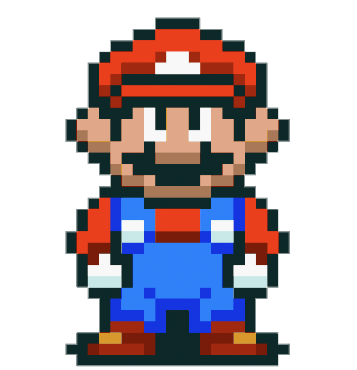

  

    
    &nbsp;
    
  

   
  

    
       
       
 

 Developer | UX/UI Designer | Tech Entusiast
 

#### 🎯 Skills

<code></code>
<code></code>
<code></code>
<code></code>
<code> </code>
<code></code>
<code></code>
<code></code>
<code></code>

#### 📈 Git Hub Stats

 

  

